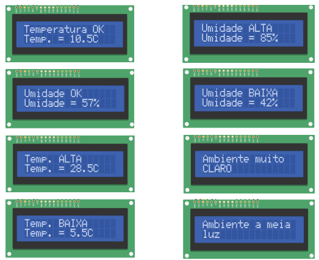

# Checkpoint-2--EdgeComputing

Tem q ter no repositório:
- [ ] imagem do circuito
- [ ] código do Arduino
- [ ] um README

  ## Descrição do Desafio
Este projeto foi desenvolvido para a **Vinheria Agnello**, com o objetivo de criar um sistema de monitoramento de **temperatura** e **umidade** do ambiente, onde os vinhos são armazenados. Para ver os valores de temperatura, umidade e luminosidade de alguma forma, sugerimos usar um display LCD para mostrar esses valores. 
O sistema visa garantir que os vinhos permaneçam em condições ideais para sua conservação.

  ## Principais Requisitos
> A fase dois do projeto para atender novos requisitos:

1. Enquanto o ambiente estiver escuro, o LED Verde deve ficar aceso;
2. Enquanto o ambiente estiver a meia luz, o LED amarelo deve ficar aceso e mensagem de
“Ambiente a meia luz” deve ser mostrado no Display;
3. Enquanto o ambiente estiver totalmente iluminado, o LED vermelho deve ficar aceso e a
mensagem “Ambiente muito claro” deve ser mostrado no display;
4. Enquanto o ambiente estiver totalmente iluminado, o Buzzer deve ficar ligado
continuamente;
5. Enquanto o ambiente estiver com uma temperatura entre 10°C e 15°C, o Display deve
informar “Temperatura OK” e também mostrar o valor da temperatura;
6. Enquanto o ambiente estiver com uma umidade entre 50% e 70%, o Display deve
informar “Umidade OK”, e também mostrar o valor da umidade;
7. Os valores apresentados no display devem ser a média de pelo menos 5 leituras dos
sensores, e os valores devem ser apresentados a cada 5 segundos;
8. Enquanto a temperatura estiver fora da faixa ideal, o LED Amarelo deve ficar aceso e o
Buzzer deve ligar continuamente;
9. Enquanto a temperatura estiver fora da faixa ideal, o Display deve informar “Temp. Alta”,
para valores acima de 15°C e também mostrar a temperatura;
10. Enquanto a temperatura estiver fora da faixa ideal, o Display deve informar “Temp.
Baixa”, para valores abaixo de 10°C e também mostrar a temperatura;
11. Enquanto a umidade estiver fora da faixa ideal, o LED Vermelho deve ficar aceso e o
Buzzer deve ligar continuamente;
12.Enquanto a umidade estiver fora da faixa ideal, o Display deve informar “Umidade. Alta”,
para valores acima de 70% e também mostrar a umidade;
13.Enquanto a umidade estiver fora da faixa ideal, o Display deve informar “Umidade. Baixa”,
para valores abaixo de 50% e também mostrar a umidade;

## Demonstração da Aplicação (MUDA O LINK E IMG)

[![Video da prática]

## Tecnologias Utilizadas

  

- **Arduino IDE**
- **Sensor integrado DHT11**
- **Um display LCD**
- **Placa Arduino** (modelo a ser especificado, por exemplo: Arduino Uno)

## Dependências

Para rodar este projeto, você precisará de:

- **Arduino IDE**: Para programar a placa Arduino.
- **Bibliotecas do Arduino**:

Além disso, você precisará do hardware adequado:

- **Placa Arduino** (por exemplo, Arduino Uno)
- **Sensor integrado DHT11**
- **Um display LCD**
- **LEDs** (Verde, Amarelo, Vermelho)
- **Resistores** para o circuito

## Como Reproduzir
### 1. **Montagem do Circuito**:

  
### 2. **Carregando o Código**:
- Abra o **Arduino IDE**.
- Baixe ou copie o código-fonte do projeto.
- Selecione a placa correta (ex: Arduino Uno) e a porta.
- Clique em "Upload" para carregar o código na sua placa.
  
### 3. **Testando o Sistema**:
-

## Autores

- [Maria Eduarda Sousa Acyole de Oliveira `566337`](https://github.com/MariaEduardaAcyole)
- [Matheus Goes da Silva `566407`](https://github.com/Goes1404)
- [Arthur Marcio de Barros Silva `563359`](https://github.com/TutuMbs)
- [Gabriela Abdelnor Tavares `562291`](https://github.com/GabihAbdTavares)

## Licença

Copyright :copyright: 2025 - Sistema de Monitoramento de temperatura e umidade para Adega – Vinheria Agnello

